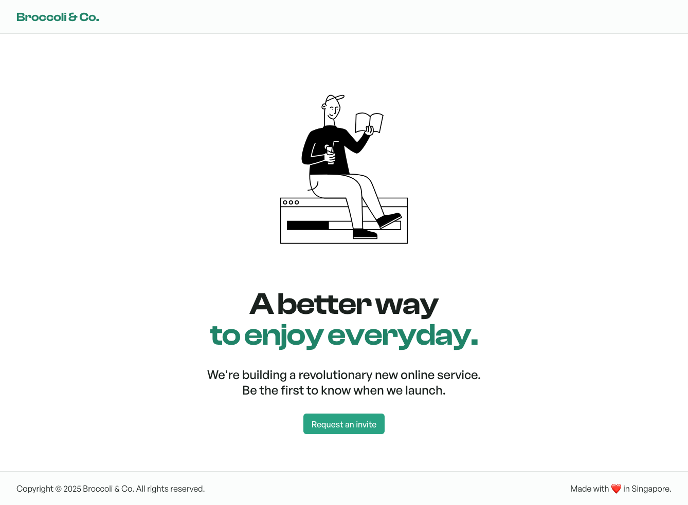

# Airwallex Code Challenge - Broccoli & Co.



Clean, minimal, and mobile-ready home page for the upcoming online service company, Broccoli & Co.

Through the site users can request an invitation for the company's services.

## Development guide

### Quickstart

I recommend using Node v20.x

```shell
# Install dependencies
npm install

# Run dev server, available at http://localhost:5173
npm run dev
```

### Tools and frameworks

The app is written in React/Typescript, using Vite as a build tool.

### UI

The app uses [Radix Themes](https://www.radix-ui.com/) for base UI components, styles, and theming.

Additional CSS styles, if required, are generally structured using [CSS modules](https://github.com/css-modules/css-modules). Component module stylesheets are mainly colocated next to their corresponding component, e.g.

```
/components
├── Form.tsx
└── Form.module.css
```

```css
/* Form.module.css */

.Form {
  background-color: red;
}
```

```tsx
// Form.tsx

import styles from './Form.module.css';

<div className={styles.Form} />;
```

### API Layer & Query Management

The app leverages [Tanstack Query](https://tanstack.com/query/latest) to wrap native Fetch requests and manage request states. This allows us to easily hook into loading or error states for ongoing queries/mutations and display the corresponding UI, e.g. a loading spinner.

The API management utils are located at the `api/` subdirectory:

```
/api
├── api.ts
├── request-invite-mutation.ts
├── other-mutation.ts
└── other-query.ts
```

`api.ts` contains the base Fetch management logic for creating typesafe query functions or mutation functions. These are then used in the `*-query.ts` or `*-mutation.ts` files, which pages and components can use to hook into to retrieve states or data.

```ts
// api.ts

export function createMutationFn<Payload, Response>({ path, fetchOpts }: CreateFetchFnOpts) {
  return async (payload: Payload) => {
    // fetch requests, handle errors
  };
}
```

```ts
// my-mutation.ts

export function useMyMutation(
  options: Omit<UseMutationOptions<void, Error, RequestInvitePayload>, 'mutationFn'>,
) {
  return useMutation<void, Error, RequestInvitePayload>({
    mutationFn: createMutationFn({ path: 'fake-auth', fetchOpts: { method: 'POST' } }),
    ...options,
  });
}
```

```tsx
// MyComponent.tsx

const MyComponent = () => {
  const { isError, mutate } = useMyMutation({});

  return (
    <div>
      {isError && <span>error occurred!</span>}
      <button onClick={mutate} />
    </div>
  );
};
```

### Forms & Schema Validation

The form is a key component of the app as it provides the main functionality of allowing users to send a request for an invitation from Broccoli & Co.

The app leverages a combination of [Zod](https://zod.dev/) for schema validation, [React Hook Form](https://react-hook-form.com/) for form setup and utils.

Zod is used for creating the initial form schema, with associated validation configuration, and error messages. Next, the schema is applied to React Hook Form which then provides the relevant form states and utils for setting up the form UI.

## Testing

### Unit Testing

The project uses a combination of [Vitest](https://vitest.dev/) and [React Testing Library](https://testing-library.com/) for scaffolding unit tests. Unit tests are generally written for testing small code utils or testing lower-level components in isolation.

Unit tests are located in `src/__tests__`. The test directory structure mirrors the external `src` directory structure for easy reference and maintenence.

All unit test files have the filename format `*.test.{ts|tsx}`.

Tests can be run with the following:

```shell
# Run unit tests
npm run test:unit

# Run unit tests with coverage
npm run test:unit:coverage

# Run tests and open the vitest UI
npm run test:unit -- --ui
```

To provide API mocks for unit testing the `request-invite-mutation`, [MSW](https://mswjs.io/) is used. The `/fake-auth` endpoint is mocked in `__tests__/mocks/api.ts`, which is then referenced during test setup to create a running instance of the MSW mock server. The mock server is run before all tests to provide the relevant API responses.

### E2E Testing

E2E tests are also provided for the following purposes:

1. Simulate complex user interactions, e.g. involving form submission from start to finish
2. Testing on actual browsers vs. a simulated browser environment via jsdom

This allows us to have the highest level of confidence in our tests for both UX correctness and browser compatibility.

Tests are written using [Playwright](https://playwright.dev/), and test files are located in `src/__e2e__`.

All e2e test files have the filename format `*.spec.ts`, in order to avoid collision with unit tests.

To run e2e tests:

```shell
# Install playwright dependencies
npx playwright install

# Run e2e tests
npm run test:e2e
```

### CI

GitHub workflows have been setup to automatically trigger the unit tests and e2e tests on push to the `main` branch. Unit test coverage files and e2e report files will be available as workflow artifacts.

## Building for production

```shell
npm run build
```
